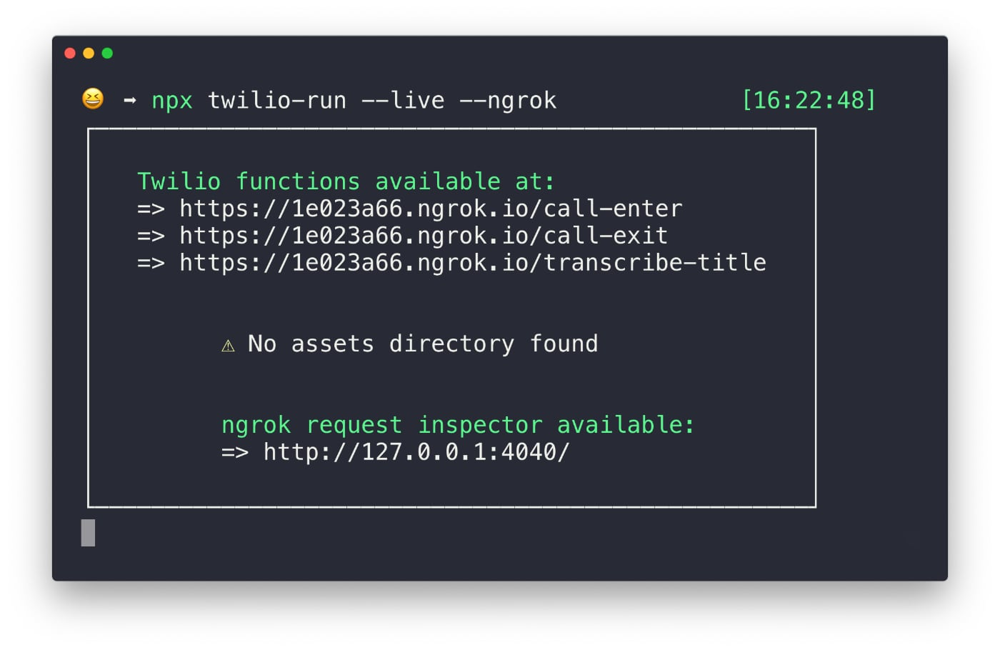
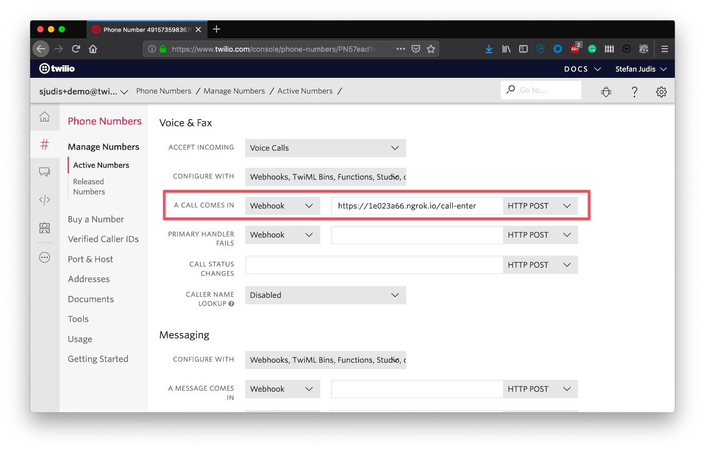

# PodBot functions

> aka how to control Twilio voice calls with Serverless functions

**This repository is the base of the Twilio tutorial [How to control and record voice messages with Node.js serverless functions TODO](...)**

It includes three serverless functions in the `functions` directory. You can use these locally by running only one command. Have fun! 👋


## Getting started

```bash
$ git clone git@github.com:stefanjudis/podbot-functions.git
$ cd podbot-functions
$ npx twilio-run
```

After running [twilio-run](https://www.npmjs.com/package/twilio-run) three functions will be accessible publicly.



Head over to your [Twilio Console](https://www.twilio.com/console/) and configure one number to call your local ngrog `/call-enter/` endpoint when a call comes in.



And that's it. Hit "save" and call your Twilio number. ☎️ You'll see `CallSid`, `RecordingUrl` and `TranscriptionText` logged to your terminal. The three provided functions will be ready for you tweak and change according to your needs. 🎉


---

For further information on how to use this project and build function driven phone calls check [the tutorial](TODO).
